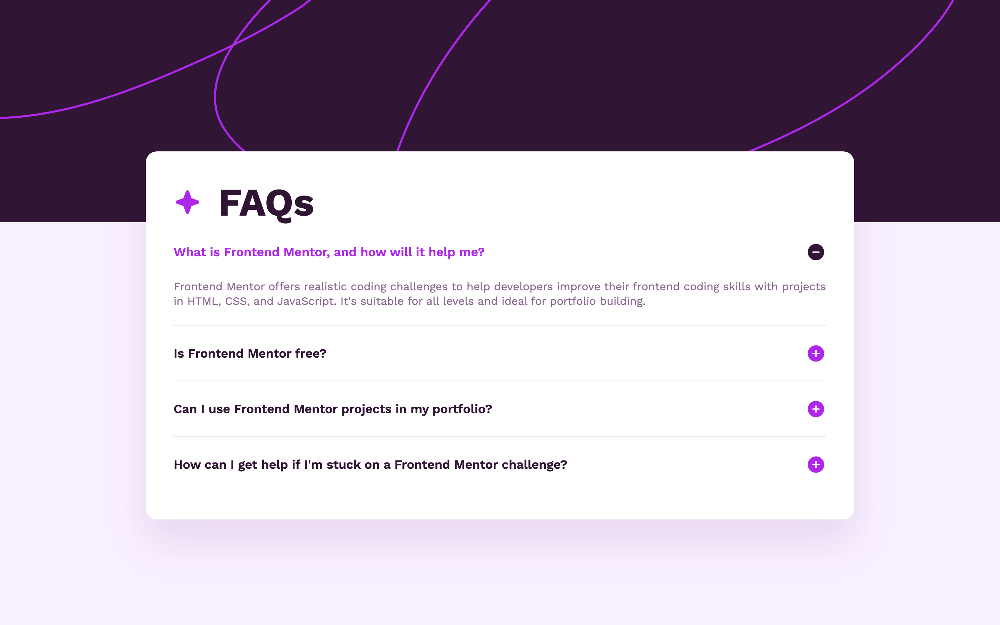

# Frontend Mentor - FAQ accordion solution

This is a solution to the [FAQ accordion challenge on Frontend Mentor](https://www.frontendmentor.io/challenges/faq-accordion-wyfFdeBwBz). Frontend Mentor challenges help you improve your coding skills by building realistic projects.

## Table of contents

- [Frontend Mentor - FAQ accordion solution](#frontend-mentor---faq-accordion-solution)
  - [Table of contents](#table-of-contents)
  - [Overview](#overview)
    - [The challenge](#the-challenge)
    - [Screenshot](#screenshot)
    - [Links](#links)
  - [My process](#my-process)
    - [Built with](#built-with)
    - [What I learned](#what-i-learned)
    - [HTML Elements](#html-elements)
    - [CSS Techniques](#css-techniques)
    - [Accessibility \& UX](#accessibility--ux)
    - [Continued development](#continued-development)
    - [Long-term Learning Path](#long-term-learning-path)
    - [Useful resources](#useful-resources)
  - [Author](#author)

## Overview

### The challenge

Users should be able to:

- Hide/Show the answer to a question when the question is clicked
- Navigate the questions and hide/show answers using keyboard navigation alone
- View the optimal layout for the interface depending on their device's screen size
- See hover and focus states for all interactive elements on the page

### Screenshot

**Mobile**

**Tablet**

**Desktop**

### Links

- Solution URL: [Add solution URL here](https://your-solution-url.com)
- Live Site URL: [GitHub Pages](https://kmulqueen.github.io/faq-accordian/)

## My process

### Built with

- Semantic HTML5 markup
- CSS custom properties
- Flexbox
- Mobile-first workflow

### What I learned

### HTML Elements

- **Details and Summary Elements**: Discovered the power of native HTML collapsible content using `
` and `
` tags. These provide built-in accordion functionality without JavaScript, including keyboard navigation and screen reader support.

### CSS Techniques

- **CSS Nesting**: Explored native CSS nesting capabilities, learning when it works in plain CSS versus when preprocessors are needed. This helped organize my media queries more efficiently. While nesting media queries worked for one media query, when I added the 2nd media query I ran into issues so reverted to separating my media queries outside of the CSS selectors.
- **Background Images with Pseudo-elements**: Mastered using `::after` pseudo-elements with background images for decorative icons, including proper sizing with `background-size: contain` vs `cover`.

### Accessibility & UX

- **Focus Management**: Understood that `summary` elements receive focus, not `details`, which is crucial for proper keyboard navigation styling.
- **Visual Feedback**: Implemented proper focus states for keyboard users while maintaining clean mouse interaction experiences.

### Continued development

### Long-term Learning Path

- Dive deeper into CSS container queries for component-based responsive design
- Study advanced accessibility patterns for complex interactive components
- Learn CSS-in-JS approaches for component libraries

### Useful resources

- [MDN: Details Element](https://developer.mozilla.org/en-US/docs/Web/HTML/Element/details) - Comprehensive documentation on the details/summary elements, including accessibility considerations and styling options.

## Author

- Website - [Kyle's GitHub](https://github.com/kmulqueen)
- Frontend Mentor - [@kmulqueen](https://www.frontendmentor.io/profile/kmulqueen)
